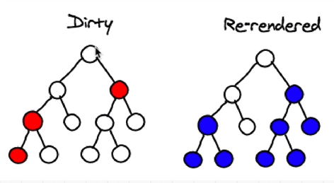
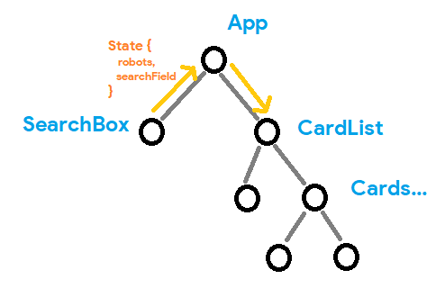

# React One Way data traversal

# Robo Friends

The __App__ has two states
    _robots_ and _searchfield_ 
whose change in value affects the virtual dom re-generation.

__App__ has two children: __SearchBox__ and __CardList__

__SearchBox__ gets input from user and passes it up to Parent App.
App then passes the updated data to CardList using State properties

Whenever sa single word appears in searchBox, __SearchBox__ calls __onsearchChange__ and updates the searchfield state in __App__ module.

The __CardList__ will be waiting for results from the __filteredRobots__ based on the newly updated state.

Usually robots are hard coded here via json file, so doesnt ned to be there in state.
But, later when this data comes from other source, we need robot as a state.

